# JT Wazuh Agent Manager v1.4.0

[English](README.md) | [繁體中文](README-zh-TW.md)

A powerful web-based management tool for Wazuh agents in cluster environments.

> **Purpose**: This tool is designed to supplement the Wazuh Dashboard by providing missing or inconvenient management features. It is **NOT** intended to replace the Wazuh Dashboard, but to complement it.

> **Recommended**: Use the Web UI as the primary interface — it's the main feature of this tool with full functionality.


🌐 **Project site:** https://jasoncheng7115.github.io/jt-wazuh-mgr/

---

## ⚡ One-line Install / Upgrade / Uninstall

Run as **root** on your Wazuh Manager (Master node in cluster mode):

```bash
# Install
curl -fsSL https://raw.githubusercontent.com/jasoncheng7115/jt-wazuh-mgr/main/install.sh | sudo bash

# Upgrade (re-run the installer; your config.yaml is preserved)
curl -fsSL https://raw.githubusercontent.com/jasoncheng7115/jt-wazuh-mgr/main/install.sh | sudo bash

# Uninstall
curl -fsSL https://raw.githubusercontent.com/jasoncheng7115/jt-wazuh-mgr/main/uninstall.sh | sudo bash
```

The installer downloads the app to `/opt/jt-wazuh-mgr`, installs Python dependencies, and registers + starts a `systemd` service (`jt-wazuh-mgr`). After installation, open **https://YOUR_WAZUH_MANAGER_IP:5000** and log in with your Wazuh API credentials.

> Already installed? You can also upgrade/uninstall locally:
> ```bash
> curl -fsSL https://raw.githubusercontent.com/jasoncheng7115/jt-wazuh-mgr/main/install.sh | sudo bash   # upgrade
> sudo bash /opt/jt-wazuh-mgr/uninstall.sh                                                                # uninstall
> ```

---

## ✨ What's New in 1.4.0

- **Bilingual UI (English / 繁體中文)** with a one-click language toggle in the header. Your choice is remembered in the browser.
- Project renamed and published as a standalone repository: **`jasoncheng7115/jt-wazuh-mgr`**.
- One-line **install / upgrade / uninstall** workflow.
- Now licensed under **Apache-2.0**.

See the full [CHANGELOG](CHANGELOG.md) for details.

## Features

### Language
- **English / Traditional Chinese (繁體中文)** switchable from the header (EN ⇄ 中文); the preference is saved per browser.

### Agent Management
- View all agents with real-time status
- Advanced filtering (status, group, node, OS, version, IP, name, sync)
- **Convenient multi-select** for batch operations
- **Distribution bar**: visual statistics bar showing agent distribution by status, OS, version, group, node, or sync status
  - Click on segments to filter agents
  - Animated transitions when switching views
- **Auto-refresh stats**: top statistics refresh every 10 seconds with slide animation
- **Group operations**: add to / remove from group, merge into another group, keep in a specific group only, rename group, **import from CSV** (with preview), **export to CSV**
- Batch operations: restart, reconnect, delete, upgrade
- **Move to Node** (planned): migrate agents to a specific node via HAProxy integration (under development)
- Health check and duplicate detection
- **Queue DB size check**: monitor agent queue database usage with batch clean support
- Agent upgrade with real-time progress tracking

### Cluster Support
- Full master/worker cluster support
- Node service status monitoring
- **Edit ossec.conf** for master and worker nodes
- **Restart services** on any node
- **Download cluster.key** from the master node
- **WPK file management**: upload and delete WPK upgrade files
- **Sync status checking** between master and workers (Rules, Decoders, Groups, Keys, Lists, SCA), including a view of files that differ between nodes
- SSH remote management for worker nodes
- **Email Alerts management**: form-based management of `<email_alerts>` rules in `ossec.conf` — add/edit/delete without manual XML editing, one-click sync to all worker nodes, auto-backup before every change

### Statistics & Reports
- Statistics by status, group, node, OS, version, network segment
- Sortable columns in all statistics tables
- Export to JSON/CSV

### Rules Viewer
- **Browse all rules** in a sortable, searchable, paginated table; filter by level range, file, and type (Custom/Built-in)
- **Rule hierarchy visualization** as a collapsible tree (parent/child via `if_sid`, `if_matched_sid`)
- Click any Rule ID to jump to its hierarchy view; expand to view full rule XML with syntax highlighting

### Security
- Input validation for all parameters; command-injection and path-traversal protection
- Secure file-upload handling
- **Complete logging & audit** of operations
- **API user management**: create, modify, and manage Wazuh API users and roles
- Brute-force protection (IP lockout: 3 failed logins = 30-minute lockout)
- See [SECURITY.md](SECURITY.md) for the security policy and hardening notes

## Screenshots

| | |
|---|---|
| Login | 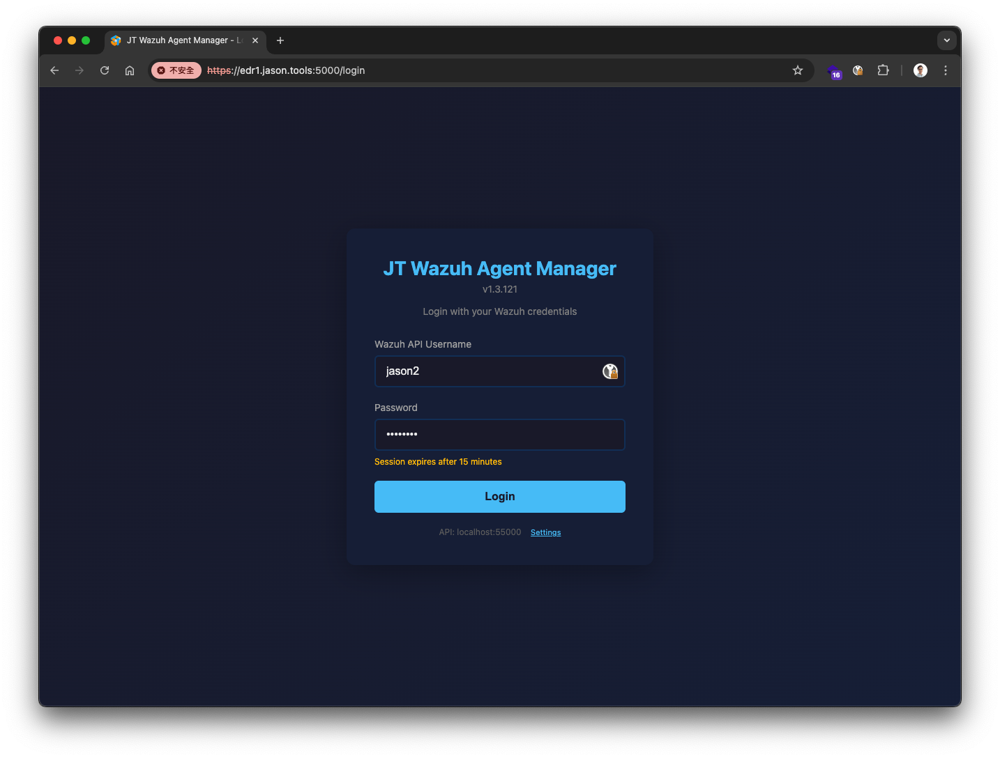 |
| Agent List | 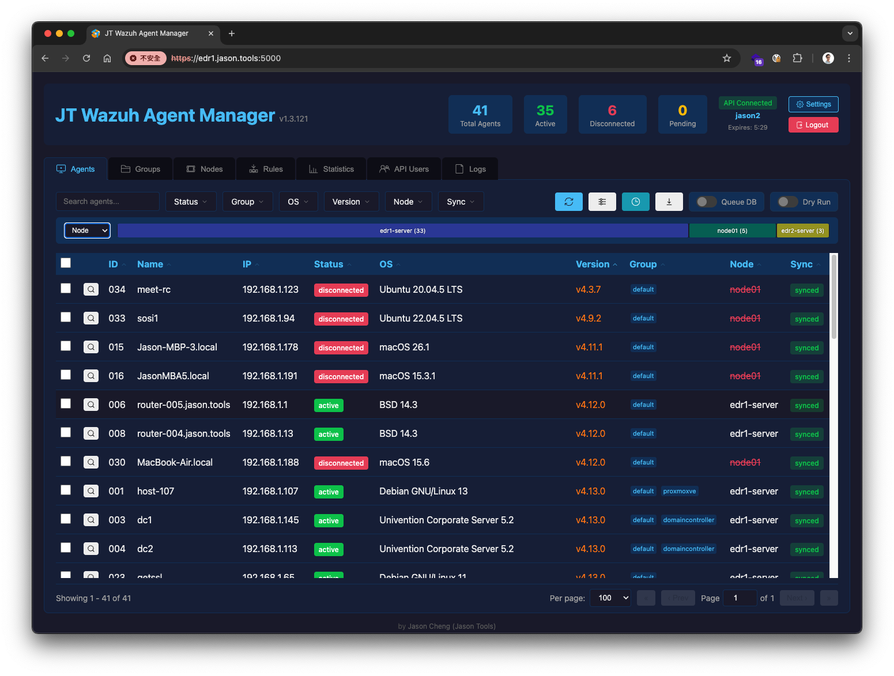 |
| Agent Actions & Queue DB | 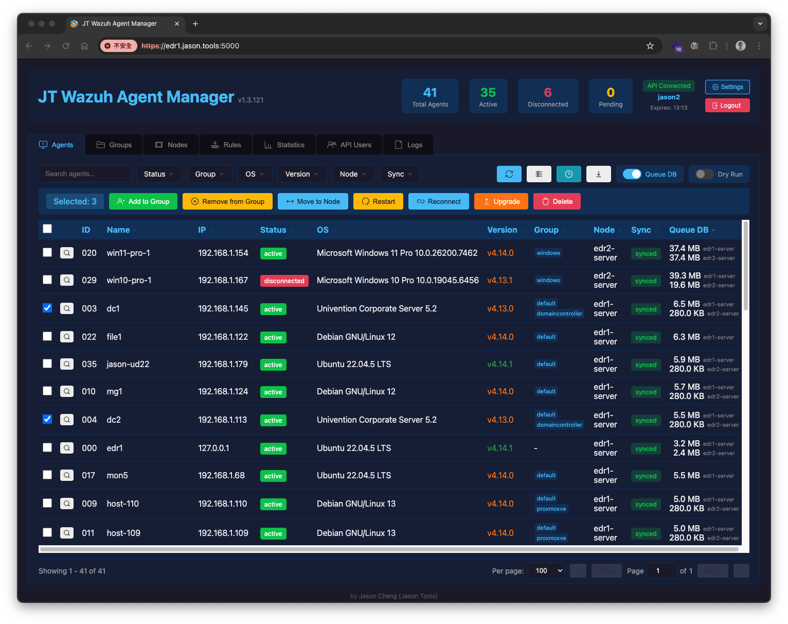 |
| Groups | 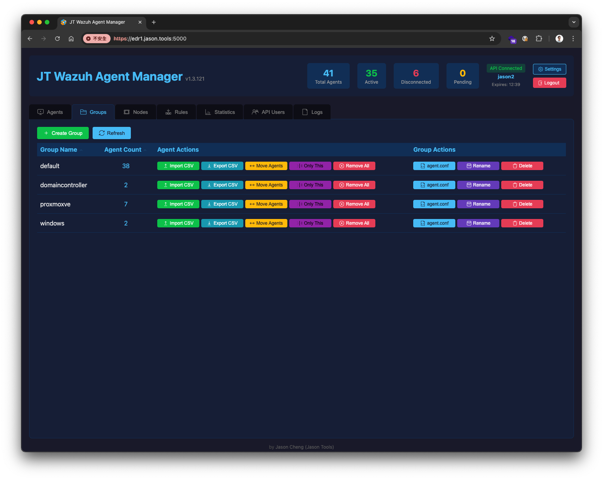 |
| Nodes | 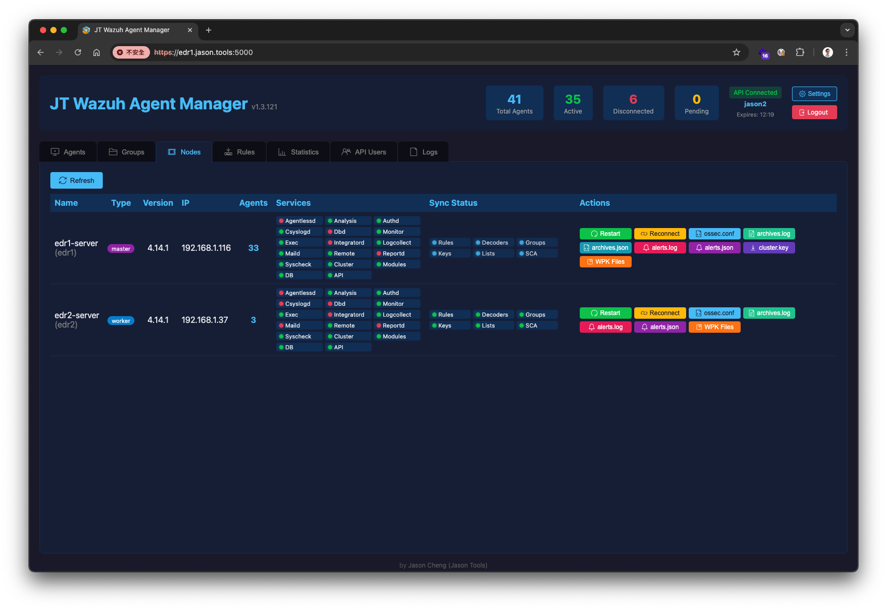 |
| WPK Files Management | 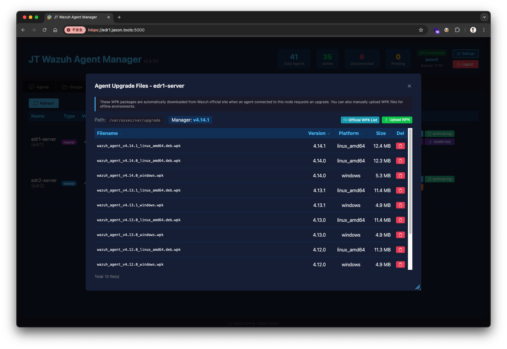 |
| Rules Viewer | 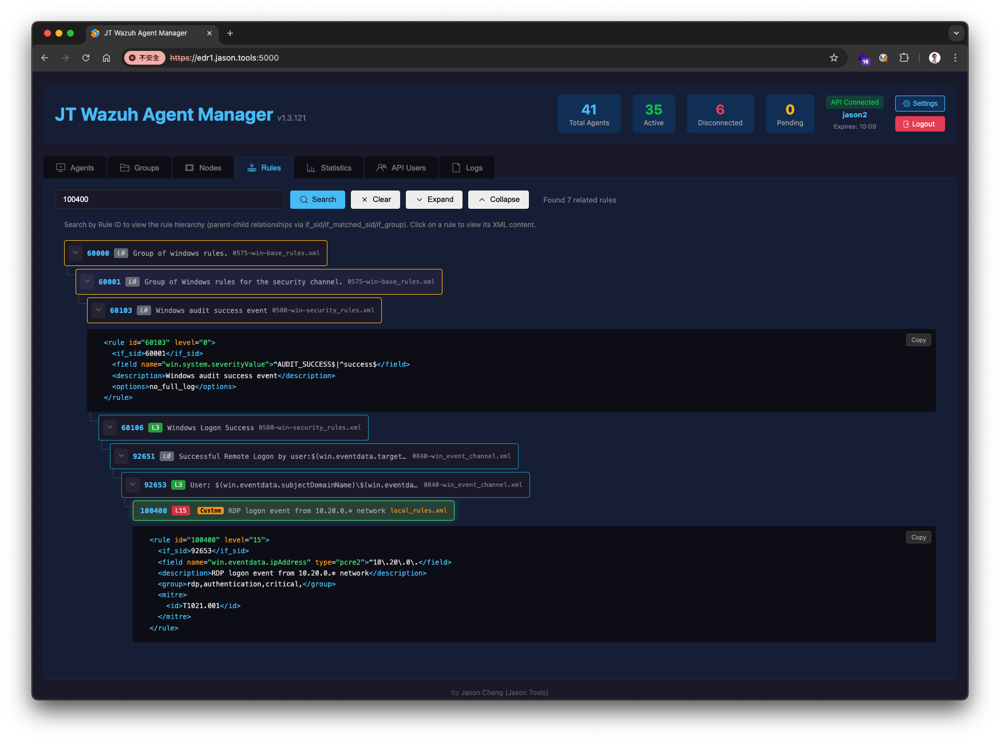 |
| API Users | 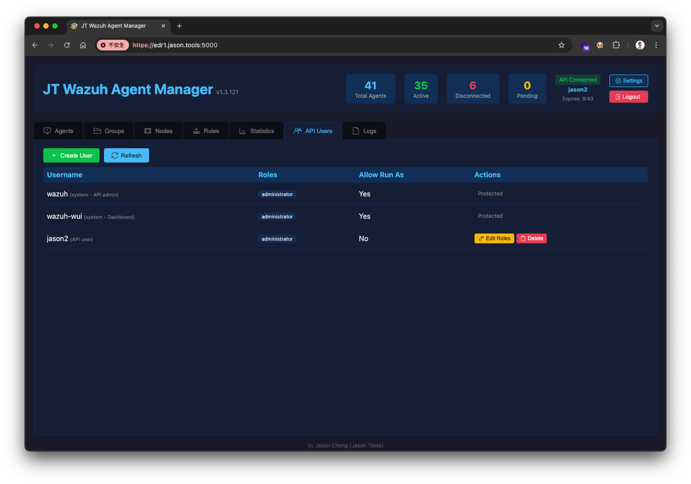 |
| Logs Viewer | 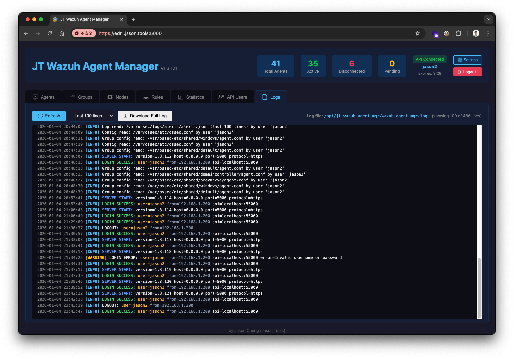 |
| Edit ossec.conf | 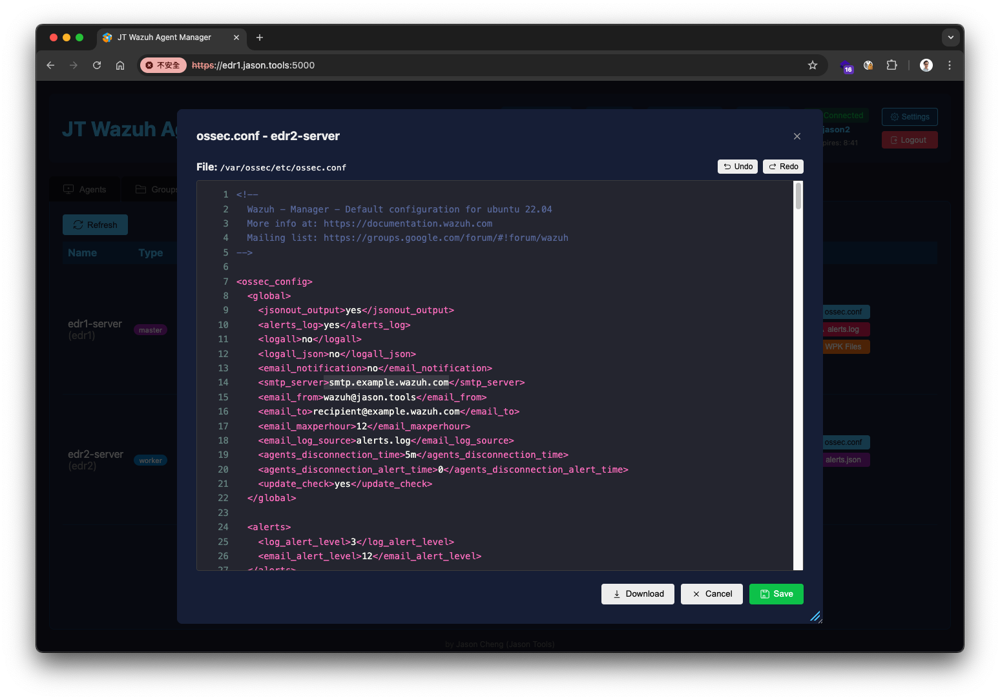 |
| Agent Upgrade | 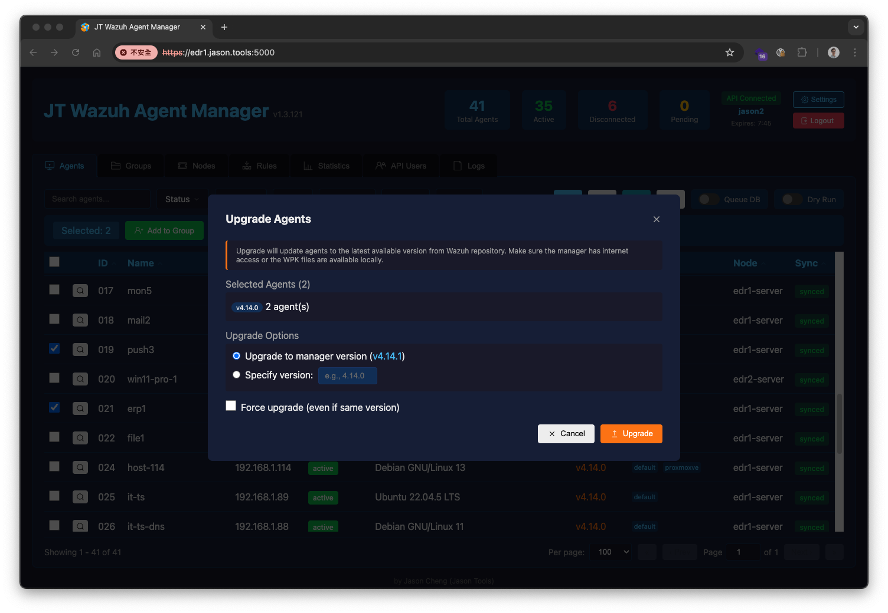  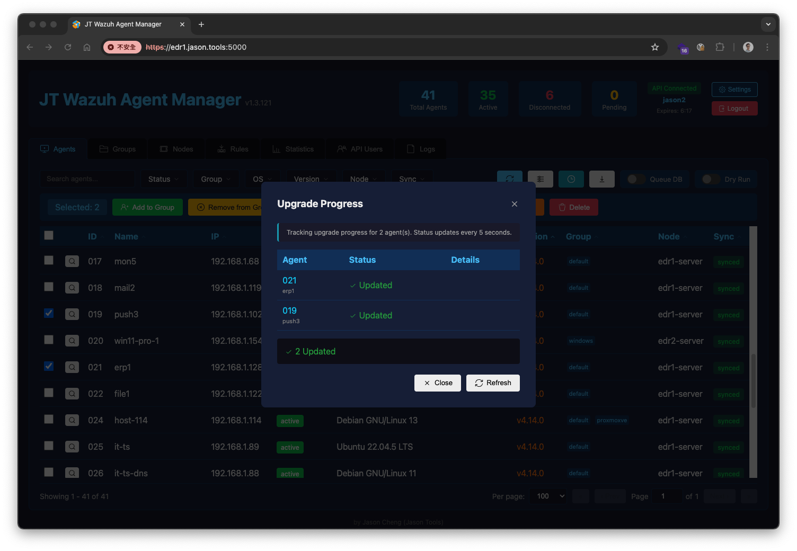 |
| Agent Detail | 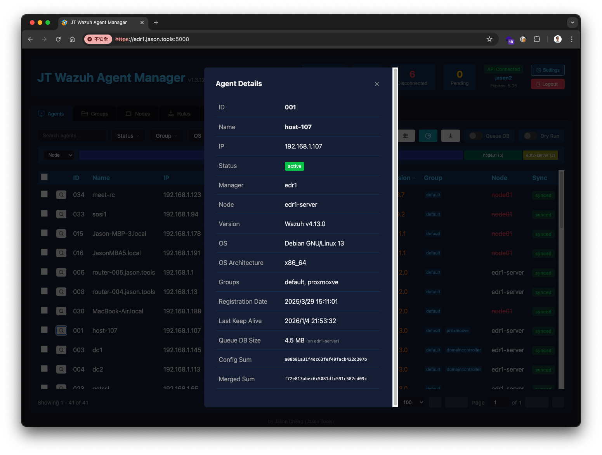 |

## Quick Start

### Requirements
- Python 3.8+
- Wazuh Manager 4.x
- **Must be installed on the Wazuh Manager** (for cluster mode, install on the Master node)

### Install

Use the [one-line installer](#-one-line-install--upgrade--uninstall) above, or run manually after cloning:

```bash
./wazuh_agent_mgr.py --web --ssl-auto
```

Open **https://YOUR_WAZUH_MANAGER_IP:5000** and log in with your Wazuh API credentials.

> **Note**: Use the `wazuh` or `wazuh-wui` account. The password can be found in `wazuh-install-files.tar` (created during installation) or in your installation records.

### Other Options

```bash
# Custom port
./wazuh_agent_mgr.py --web --port 8443 --ssl-auto

# Custom SSL certificate
./wazuh_agent_mgr.py --web --ssl-cert /path/to/cert.pem --ssl-key /path/to/key.pem
```

### systemd Service

The installer registers and starts a systemd service automatically. Management commands:

```bash
systemctl status jt-wazuh-mgr       # Check status
systemctl restart jt-wazuh-mgr      # Restart service
journalctl -u jt-wazuh-mgr -f       # View logs
```

## CLI Usage

```bash
# List all agents
./wazuh_agent_mgr.py agent list

# Filter agents
./wazuh_agent_mgr.py agent list --status=Active --group=production

# Quick status queries
./wazuh_agent_mgr.py agent disconnected
./wazuh_agent_mgr.py agent pending

# Group management
./wazuh_agent_mgr.py group list
./wazuh_agent_mgr.py group add-agent webservers 001 002 003

# Node management
./wazuh_agent_mgr.py node list
./wazuh_agent_mgr.py node reconnect 001 002

# Statistics
./wazuh_agent_mgr.py stats report
```

### Output Formats

Supports three output formats: `table` (default), `json`, `csv`.

```bash
./wazuh_agent_mgr.py agent list --format=json
./wazuh_agent_mgr.py agent list --format=csv > agents.csv
./wazuh_agent_mgr.py stats report --format=json > report.json
```

### Dry-Run Mode

All write operations support `--dry-run` to preview actions without executing:

```bash
./wazuh_agent_mgr.py agent delete 001 --dry-run
# Output: [DRY-RUN] Would execute: /var/ossec/bin/manage_agents -r 001
```

## Configuration

`config.yaml` (a template is included; **no credentials are required for Web UI mode**):

```yaml
wazuh_path: /var/ossec

# API settings
# Web UI mode: username/password NOT required (users log in via the browser)
# CLI mode: username/password REQUIRED for commands like ./wazuh_agent_mgr.py agent list
api:
  enabled: false           # set to true for CLI mode
  host: localhost
  port: 55000
  username: wazuh          # only for CLI mode
  password: ""             # only for CLI mode, see wazuh-install-files.tar
  verify_ssl: false

# Web UI settings
web:
  session_timeout: 120     # minutes

# Optional: SSH for remote worker node management
# ssh:
#   enabled: true
#   key_file: /root/.ssh/wazuh_cluster_key
#   nodes:
#     worker01:
#       host: 192.168.1.100
#       port: 22
#       user: root
```

### Web UI vs CLI Configuration

| Setting | Web UI | CLI |
|---------|--------|-----|
| `api.enabled` | Not required | `true` |
| `api.username` | Not required (login via browser) | Required |
| `api.password` | Not required (login via browser) | Required |
| `ssh.*` | Optional (for remote node management) | Optional |

## Internationalization (i18n)

The UI ships in English and translates to Traditional Chinese entirely on the
client side. UI strings live in `lib/i18n_engine.js`, which is embedded into
`lib/web_ui.py` by `tools/build_i18n.py`. To extend or edit translations:

```bash
# edit lib/i18n_engine.js, then re-embed into web_ui.py
python3 tools/build_i18n.py
```

## Tech Stack

- **Backend**: Python, Flask
- **Frontend**: Vanilla JavaScript, CSS (no framework)
- **Wazuh Integration**: CLI commands + REST API

## Disclaimer

This software is provided "as is" without warranty of any kind, express or implied. The author is not responsible for any damages or losses arising from the use of this software. Use at your own risk.

Before performing any operations (especially delete, restart, or upgrade), it is strongly recommended to:
- Use `--dry-run` mode to preview actions
- Back up important configurations
- Test in a non-production environment first

## License

Licensed under the [Apache License 2.0](LICENSE).

## Author

Jason Cheng (Jason Tools)
